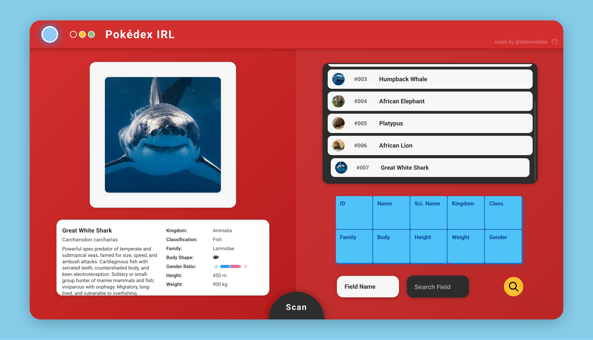

# PokeDex IRL

PokeDex IRL is an open-source application that identifies real-world animals, insects, and sea life from images and generates creative, Pokédex-style entries using AI and LangGraph agents. It features a modern React UI and a robust FastAPI backend.


---

## Features

- **Image Upload & Validation**: Upload images of animals, insects, or sea life for instant identification.
- **AI-Powered Identification**: Uses advanced LLMs and LangChain agents to identify creatures and generate detailed, Pokédex-style entries.
- **REST API**: FastAPI-based backend with endpoints for image upload, creature CRUD, search and identification.
- **Database Storage**: Stores creature data in SQLite using SQLModel/SQLAlchemy.
- **Modern Web UI**: Vite/React TypeScript frontend for a seamless Pokédex experience.
- **Extensible Agents**: Modular agent architecture for scanning and explanation, powered by LangGraph and LangChain.


---

## Tech Stack

- **Backend**: Python 3.12+, FastAPI, SQLModel, SQLAlchemy, Pydantic, Uvicorn, Loguru, LangChain, LangGraph
- **Frontend**: React 19+, TypeScript, Vite
- **Database**: SQLite
- **AI/LLM**: OpenAI-compatible LLMs (configurable)

---

## Project Structure

```
pokedex-irl/
├── pokedex-service/         # FastAPI backend, AI/LLM logic, database, API
│   ├── src/pokedex/
│   │   ├── agent/           # LangChain/LangGraph agents (scanner, explainer)
│   │   ├── creature/        # Creature models, CRUD, dependencies, utils
│   │   ├── config.py        # App configuration
│   │   ├── database.py      # DB setup and session
│   │   ├── llm.py           # LLM integration
│   │   └── main.py          # FastAPI app entrypoint
│   ├── pokedex.db           # SQLite database
│   └── pyproject.toml       # Python project config & dependencies
├── pokedex-ui/              # Vite/React TypeScript frontend
│   ├── src/
│   │   ├── App.tsx, CreatureList.tsx, CreatureCard.tsx, NavBar.tsx, ScanPopup.tsx, ...
│   └── package.json, vite.config.ts, tsconfig.json, ...
├── static/uploads/          # Uploaded images
├── README.md                # This file
└── LICENSE                  # Apache 2.0 License
```

---

## Getting Started

### Prerequisites
- Python 3.12+
- Node.js 18+

### Backend Setup

```bash
cd pokedex-service
python -m venv venv
source venv/bin/activate  # On Windows: .\venv\Scripts\activate
pip install .
# Or, for development:
pip install -e .[test]
```

**Create required directories:**
```bash
mkdir -p static/uploads
```

**Run the development server:**
```bash
uvicorn src.pokedex.main:app --reload
```

**API Documentation:**
- Swagger UI: [http://localhost:8000/api/v1/docs](http://localhost:8000/api/v1/docs)
- ReDoc: [http://localhost:8000/api/v1/redoc](http://localhost:8000/api/v1/redoc)

### Frontend Setup

```bash
cd pokedex-ui
npm install
npm run dev
```

Open [http://localhost:5173](http://localhost:5173) in your browser.

---

## Usage
1. Start the backend and frontend servers as above.
2. Open the frontend in your browser (default: http://localhost:5173).
3. Upload an image to receive a Pokédex-style entry and detailed explanation.

---

## API Overview

- `POST /api/v1/creature/identify` — Upload an image to identify a creature and generate a Pokédex entry.
- `GET /api/v1/creature/` — List all creatures in the database.
- `GET /api/v1/creature/{id}` — Get details for a specific creature.
- `GET /api/v1/creature/search` — Search creatures by name or description.

See Swagger UI for full API details.

---

## Configuration

Environment variables can be set in a `.env` file in `pokedex-service/` (see `src/pokedex/config.py` for all options):

- `MODEL_NAME`, `MODEL_API_KEY`, `MODEL_ENDPOINT` — LLM configuration
- `IMAGE_MODEL_NAME`, `IMAGE_MODEL_ENDPOINT`, `IMAGE_MODEL_API_KEY` — Image model config

---

## Contributing

Contributions are welcome! Please open issues or pull requests for bug fixes, features, or improvements.

---

## License

Apache License 2.0 — See [LICENSE](LICENSE) for details.
